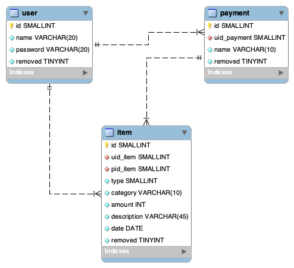

# Housekeeping Book

거래내역을 추가, 수정, 삭제 할 수 있습니다.

캘린더를 통해 일별 수입, 지출을 확인할 수 있습니다.

월별 카테고리별, 일별 지출을 차트로 확인할 수 있습니다.


## Contributors
- [Eunjung Jenny Jeon](https://github.com/eunjung-jenny)
- [Soojung Lee](https://github.com/sooojungee)

## Model


## Installation
```
git clone https://github.com/woowa-techcamp-2020/hkb-4.git
```

## Start
### 1. npm install
```
npm install
```
### 2. add .env
```
PORT=0000
DB_HOST=0.00.000.00
DB_USER=username
DB_DB=dbname
DB_PW=dbpassword
```
### 3. build
```
npm run build
```
### 4. start server
```
npm run start
```

### 5. 로그인
회원가입을 구현하기 전이기 때문에 아래의 계정으로 접속해서 사용해보세요.
```
id: eunjung
pw: eunjung
```

## FrontEnd Architecture
- [observer & mvc pattern](https://github.com/woowa-techcamp-2020/hkb-4/wiki/observer-%ED%8C%A8%ED%84%B4-%EA%B4%80%EB%A0%A8-%EC%83%9D%EA%B0%81-%EC%A0%95%EB%A6%AC)
